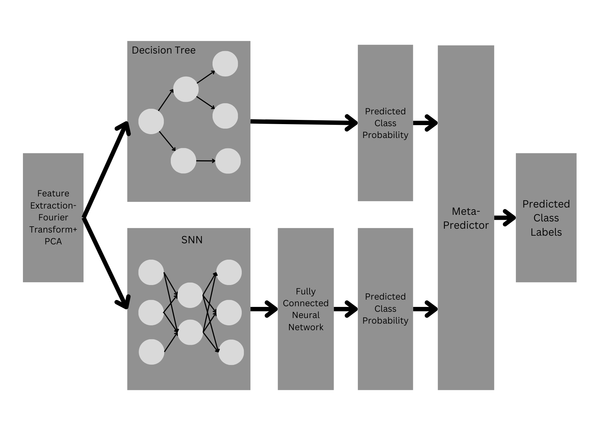

# Connecting Brains and Interfaces: Real-Time EEG-Based Stress Detection via Spiking Neural Networks

This repository provides the reference implementation of our paper accepted at [ACM COMPASS 2025](https://compass.acm.org/). 

> **Note**: The corresponding ACM Digital Library entry will be updated here once the paper is officially published.

This project presents a novel approach for efficient, real-time classification of brain signals using Spiking Neural Networks (SNNs). Designed for low-power brain-machine interface applications, the architecture processes EEG data in just a few time steps.

The core of the system is a multi-layer SNN model that generates spike-based predictions, which are then combined using an ensemble of:

- Support Vector Classifier (SVC) and

- XGBoost decision trees.

Performance was benchmarked against a modified Symmetric Convolutional and Adversarial Neural Network (SCANN):

- 3-class EEG task (1500 ms / 300 timesteps):
Ours: 43% vs SCANN: 38%

- 2-class EEG task (500 ms / 100 timesteps):
Ours: 60% vs SCANN: 50%

> This is a reference implementation accompanying our paper at ACM COMPASS 2025. The repository is still evolving.

## Dataset 
The work makes use of the EEG dataset collected for mental stress classification in [1].

## Code Description 

``` sota.py ``` implements SCANN [2], with certain tweaks. To adapt the model for real-time EEG prediction, two key modifications were made:

1. PCA on Fourier-Transformed EEG Signals:
Instead of using raw EEG data, the model learns from PCA-reduced components of Fourier-transformed signals. This provides stable, fixed-length features to the network, enabling consistent processing despite the dynamic nature of live EEG input.

2. Adversarial Training with Noise Injection:
A Generator is trained to produce realistic EEG-like features by injecting structured noise alongside real PCA features. A Discriminator then distinguishes between genuine and generated data, helping the Generator maintain realistic outputs while preserving the original data structure.  

``` rf_snn.py ``` (requires specifying the number of classes) implements the proposed spike-inspired neural architecture 

 In summary, our work hopes to contribute to the burgeoning field of brain-machine interfaces by leveraging SNNs for decoding EEG signals in real-time by putting forward the following key proposals:  
[1] A spike-based environment to learn real-time EEG recordings along with decision trees.  
[2] A feature extraction framework using Fourier Transforms coupled with Principal Component Analysis so that decision trees receive a fixed number of features representing dynamic EEG recordings.  
[3] A variant of Spike Timing Dependent Plasticity Rule for synaptic weight updates in a spike environment free of sequential loops, thus proposing a vectorised form of STDP updates to make them compatible with hardware acceleration.

``` python gen_snn_rf.py ``` generates a csv file containing accuracy (when proposed SNN architecture is used) at specified training (= [20, 100, 600]) and testing timesteps (=[20, 100, 200, 300, 600]) of EEG recording (requires specifying path to folder where the data resides). 

``` python gen_sota.py ``` generates a csv file containing accuracy (when modified SCANN is used) at specified training (= [20, 100, 600]) and testing timesteps (=[20, 100, 200, 300, 600]) of EEG recording (requires specifying path to folder where the data resides). 

``` collect_results.py ``` can be used to generate plots to demonstrate the performance of our proposed model and SCANN with the mentioned modifications. 
## References

[1] Amit Kumar, J.K. Barath, P. Shanmukh, and Deepak Joshi. 2024. StreXNet: A
 Novel End-to-End Deep Learning Based Improved Multi-Level Mental Stress
 Classification from EEG Sensors. IEEE Sensors Journal (2024), 1–1. doi:10.1109/
 JSEN.2024.3506984

[2]  R. Fu, L. Wu, X. Zhang, Y. Huang, J. Jin, and Z. Zhang. 2022. Symmetric Con
volutional and Adversarial Neural Network Enables Improved Mental Stress
 Classification From EEG. IEEE Transactions on Neural Systems and Rehabilitation
 Engineering 30 (2022), 1384–1400. doi:10.1109/TNSRE.2022.3174821

## Citing Us
 Amit Kumar, Anannya Mathur, and Deepak Joshi. 2025. Connecting Brains
 and Interfaces: Real-Time EEG-Based Stress Detection via Spiking Neural
 Networks.InACMSIGCAS/SIGCHIConferenceonComputingandSustainable
 Societies (COMPASS ’25), July 22–25, 2025, Toronto, ON, Canada. ACM, New
 York, NY, USA, 6 pages. https://doi.org/10.1145/3715335.3736311
